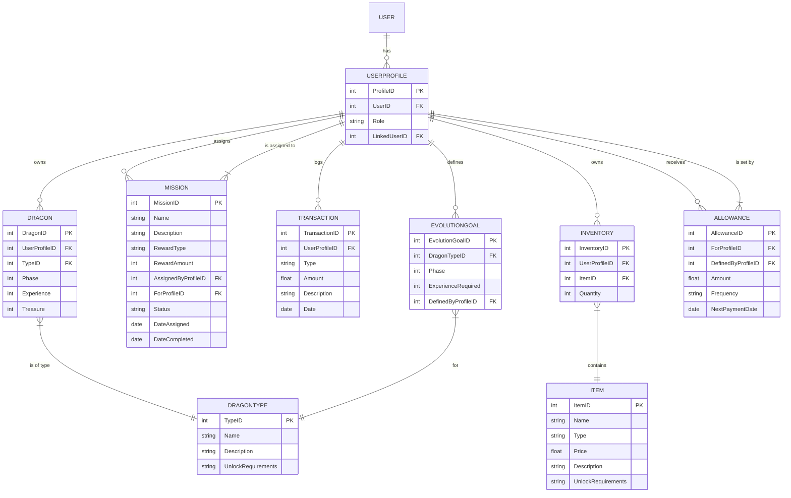

# Backend


Aplicar migraciones:

```bash
docker compose run --rm api python manage.py makemigrations
docker compose run --rm api python manage.py migrate
```

Ejecutar test:

```bash
docker compose exec api pytest
```

Crear superusuario:

```bash
docker compose exec api python manage.py createsuperuser
```

